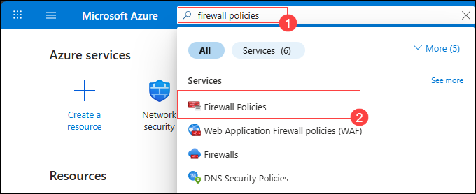
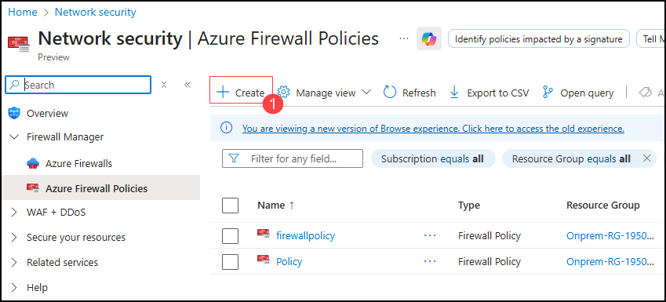

# Exercise 2: Create a secured Virtual Hub and Azure firewall

A secured hub is an Azure Virtual WAN hub with an Azure Firewall. This exercise walks you through the steps to convert a virtual WAN hub to a secured hub by installing Azure Firewall directly from the Azure Virtual WAN portal pages.

## Task 1: Create an Azure Firewall Policy

In this task, you will create and configure the Azure firewall Policy inside the firewall manager.

1. In the Azure portal, type **Firewall policies (1)** in the search box and select **Fiirewall policies(2)** from the results.
 
   
 
1. Select **+ Create** to create Azure Firewall Policy.

   
 
1. On the Azure Firewall Policy page, on the **Basics** tab, enter or select the following information and click on **Next: DNS Settings > (5)**.
 
   | **Setting**      | **Value**                                                    |
   | ---------------- | ------------------------------------------------------------ |
   | Subscription     | Select your subscription.                                    |
   | Resource group   | Select the resource group **Sharedservices-RG-<inject key="DeploymentID" enableCopy="false"/> (1)** |
   | Name             | Enter **Policy-01 (2)**                                      |
   | Region           | Select **<inject key="Sharedservices-RG Region" enableCopy="false"/> (3)** |
   | Policy tier      | Select **Standard (4)**                                      |
 
    
 
1. On the **DNS Settings** tab, leave it as default and click on **Next: TLS inspection >**.
 
   
 
1. On the **TLS inspection** tab, leave it as default and click on **Next: Rules >**.
 
   

1. On the **Rules** tab, select **+ Add a rule collection**.

   
 
1. On the **Add a rule collection** blade, enter or select the following information:
 
    - Name: **App-RC-01 (1)**
    - Rule Collection type: **Network (2)**
    - Priority: **100 (3)**
    - Rule collection action: **Allow (4)**
    - Under **Rules (5)** mention the below details:
      - Name: Enter **AllowWeb**
      - Source type: Select **IP Address** from the drop-down list
      - Source: Enter *
      - Protocol: Select **TCP**
      - Destination Ports: **80**
      - Destination Type: Select **IP Address**
      - Destination: Enter *
    - On the next rule row, enter the following information:
      - Name: Enter **AllowRDP**
      - Source type: Select **IP Address** from the drop-down list
      - Source: Enter *
      - Protocol: Select **TCP**
      - Destination Ports: **3389**
      - Destination Type: Select **IP Address**
      - Destination: Enter *
    - Click on **Add (6)**
 
      
 
1. Select **Review + Create**.
 
   
 
1. Review the **Summary** page and then select **Create**.
 
   

> **Congratulations** on completing the task! Now, it's time to validate it. Here are the steps:
> - Hit the Validate button for the corresponding task. If you receive a success message, you can proceed to the next task. 
> - If not, carefully read the error message and retry the step, following the instructions in the lab guide. 
> - If you need any assistance, please contact us at cloudlabs-support@spektrasystems.com. We are available 24/7 to help you out.

<validation step="ca8e498a-a72e-40ea-afb4-5c1fae48fd82" />

## Task 2: Deploy a firewall with an existing policy

In this task, you will convert a virtual WAN hub to a secured hub by deploying Azure Firewall directly from the Azure Virtual WAN.

1. Navigate to the home page in the Azure portal, type **Virtual WANs (1)** in the search box and select **Virtual WANs (2)** from the results.

   

1. On the **Virtual WANs** page, select **vwan-prod-001**.

   

1. On the **Basics** tab of the **vwan-prod-001** page, select **Hubs (1)** under the Connectivity section from the left navigation pane, and then click on **vwan-hub-prod-002 (2)**.

   .png)

1. Once in the hub properties, select **Azure Firewall and Firewall Manager** under the Security section on the left navigation pane.

   

1. Select the **vwan-hub-prod-002 (1)**, click on **Manage security (2)**, and select **Deploy a firewall with an existing policy (3)**.

   .png)

1. On the **Azure Firewall** page, enter or select the following information and click on **Next: Review + confirm > (4)**.

    - Azure Firewall tier: Select **Standard (1)**

    - Availability zone: **(By default its none) (2)** 

    - Select **Policy-01 (3)** from Firewall Policy.

       .png)
      
1. Review the **Summary** page and select **Confirm**. 

   
 
1. Once the deployment is successful, navigate to the virtual hub **vwan-hub-prod-002**. After the hub has been converted into a secured hub, the **Azure Firewall status** will be displayed as shown in the image below:

   .png)

> **Congratulations** on completing the task! Now, it's time to validate it. Here are the steps:
> - Hit the Validate button for the corresponding task. If you receive a success message, you can proceed to the next task. 
> - If not, carefully read the error message and retry the step, following the instructions in the lab guide. 
> - If you need any assistance, please contact us at cloudlabs-support@spektrasystems.com. We are available 24/7 to help you out.

<validation step="eb34d716-1e91-40d9-bc37-bf05f4fcea1a" />

Now, click on **Next** from the lower right corner to move to the next page.

## Summary:

In this exercise, you have covered the following:

- Created and configured an Azure firewall policy
- Deployed a firewall with an existing policy
